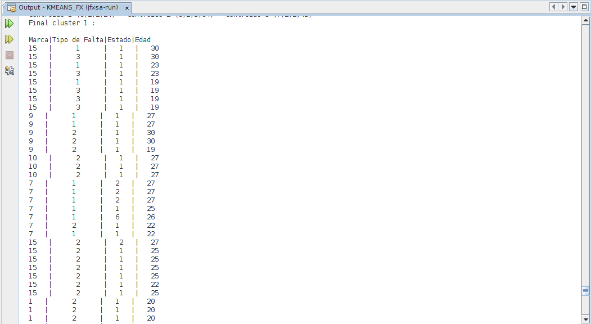
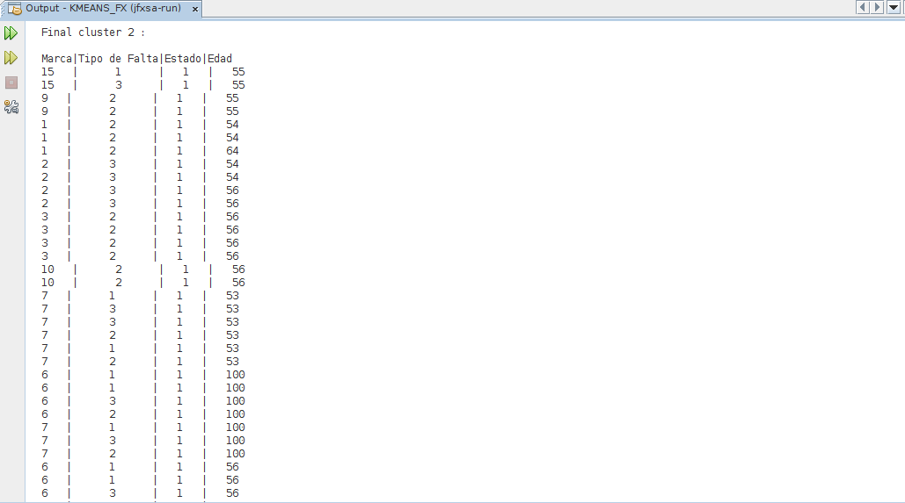
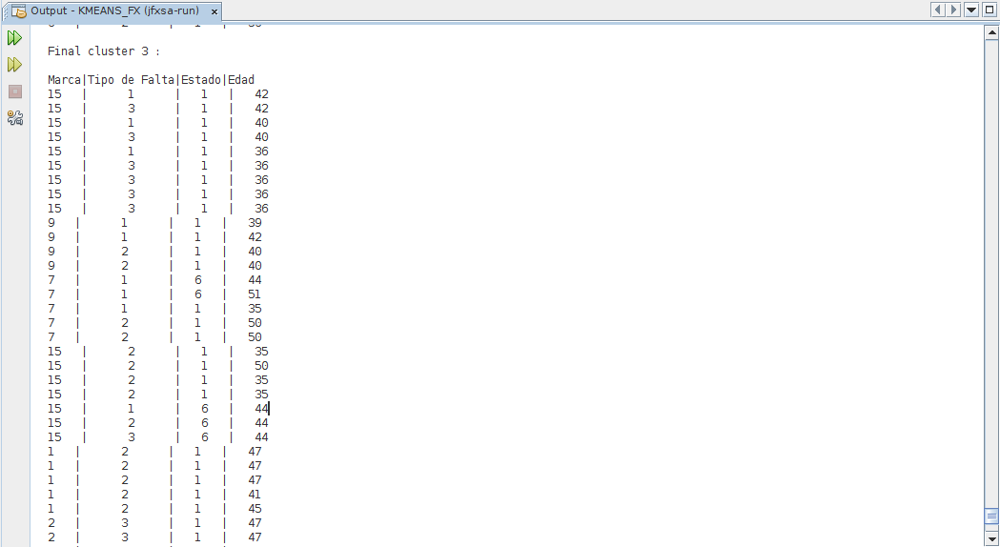

# K-Means-in-JavaFX
K-Means is a grouping algorithm used in various fields, for example, in market segmentation.

### Implementation

### Example

First Iteration.
Objects in cluster 1 :84
Objects in cluster 2 :43
Objects in cluster 3 :72

Final Iteration.

Objects en cluster 1 :93

Objects en cluster 2 :34

Objects en cluster 3 :72

