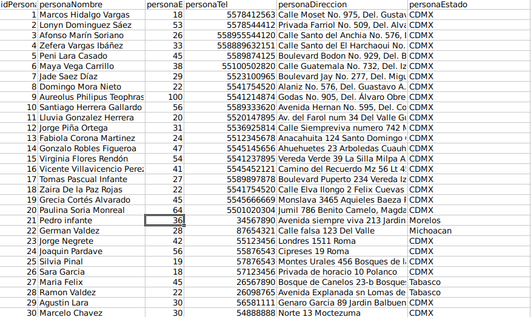
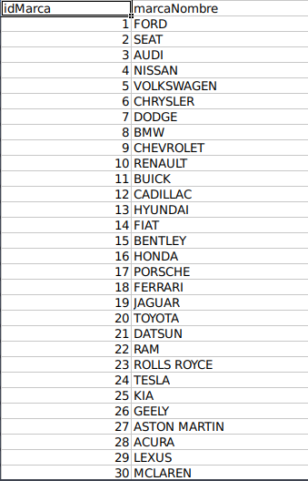
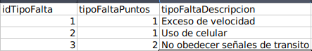
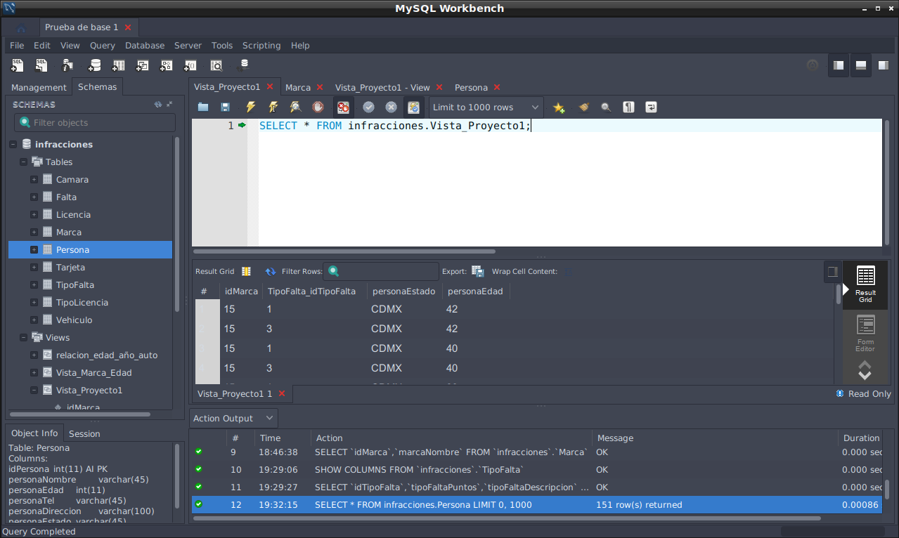
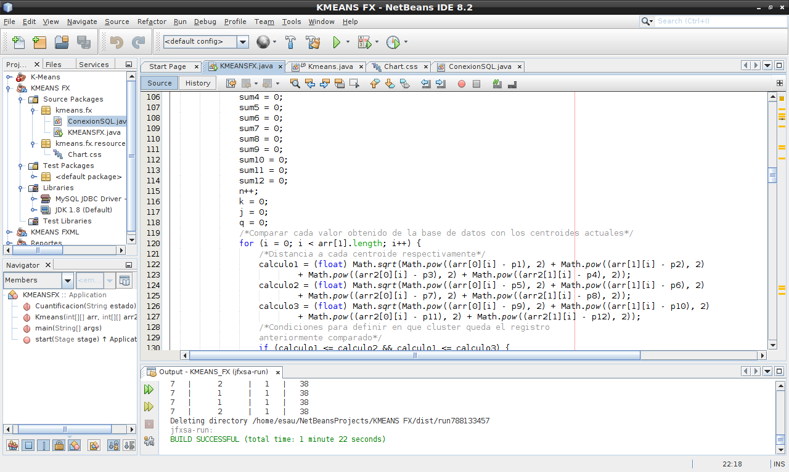

# K-Means-in-JavaFX
K-Means is a grouping algorithm used in various fields, for example, in market segmentation.


Consists in endowing the objects with coordinates (in this case characteristics that identify them), take m (m is the number of clusters in which we wish to segment) objects randomly as centroids and all the remaining ones grouped with respect to the centroids. We look for the Euclidean Distance of the object to be classified with respect to each of the centroids, the cluster to which it is assigned depends on the shortest distance of the object with the centroid.


In this project (199) Automobile Accidents are segmented, based on the following characteristics:

- Duct age
- Car brand
- State of the country
- Type of Incident


Below are the important tables (in format .csv and visualized with LibreOffice Calc) for the realization of this project.




The data is taken from a database made in class, so the following Minable View is performed to obtain the data that our algorithm will use:
```
VIEW `Vista_Proyecto1` AS
    SELECT 
        `Marca`.`idMarca` AS `idMarca`,
        `Falta`.`TipoFalta_idTipoFalta` AS `TipoFalta_idTipoFalta`,
        `Persona`.`personaEstado` AS `personaEstado`,
        `Persona`.`personaEdad` AS `personaEdad`
    FROM
        ((((`Marca`
        JOIN `Vehiculo` ON ((`Vehiculo`.`Marca_idMarca` = `Marca`.`idMarca`)))
        JOIN `Falta` ON ((`Falta`.`Vehiculo_idVehiculo` = `Vehiculo`.`idVehiculo`)))
        JOIN `Tarjeta` ON ((`Vehiculo`.`idVehiculo` = `Tarjeta`.`Vehiculo_idVehiculo`)))
        JOIN `Persona` ON ((`Persona`.`idPersona` = `Tarjeta`.`Persona_idPersona`)))
```
In order to properly use the algorithm, the data must be quantified, therefore data such as "Estado" is transformed within the code. In other data such as "Marca" and "Tipo de Falta" your ID is used.


The program runs mainly on the NetBeans console, however, the data was also plotted and shown in 2-dimensional graphs, since displaying a 4-dimensional graph is impossible.


First Iteration.
Objects in cluster 1 :84
Objects in cluster 2 :43
Objects in cluster 3 :72

Final Iteration.

Objects in cluster 1 :93

Objects in cluster 2 :34

Objects in cluster 3 :72


### Software

-MySQL Workbench 6.3 Community

-NetBeans IDE 8.2


